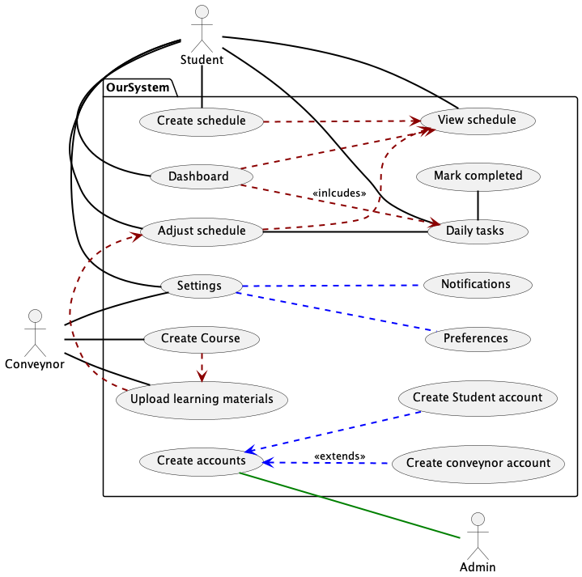

# Use Case Descriptions: :pencil:

## :mag_right: Use case one

### Use case name
Create Schedule
### Purpose
The purpose of this is to allow the primary user (students) to mark things into their calendar for example creating a revision time table of a sorts.
### Author
Jan W Makarewicz
### Date
30/4/2022
### Related requirements
Users are able to select the most optimal study split from a pre-made list.
### Actors involved
The primary actors are the students and the secondary actors are the module convenor.
### Priority
It is very important as the student will likely be keeping track of the schedule created and could be making changes to their schedules.
### Typical flow of events
It includes being able to view the schedule that you have created.
### Alternative event flows
It extends making an account as you would need an account to make this use case even work.

## :mag_right: Use case two

### Use case name
Student wishes to mark their daily tasks as complete.
### Purpose
The end goal of this use case is to allow students to mark any daily tasks that they have completed easily, to allow them to better manage their time and have a stronger understanding of outstanding work when planning future tasks. It would also be benificial as it would also allow the application to understand which tasks are outstanding when planning a timetable for the student. 
### Author
Jaysinh Maher
### Date
30/04/2022
### Related requirements
This satisfies many of our functional requirement, specifically "The system must adjust the user's study schedule when daily tasks are not complete". This is because in order to alter the study schedule to be more efficient the system must know which tasks are and are not outstanding. Another functional requirement that is satisfied is "Each day the system will notify the user of their daily tasks to complete". This is because once again to help students stay on top of work these notifications are necassary and cannot be accurate unless the user can mark completed tasks.
### Actors involved
who are the primary/secondary actors for this use case?
### Priority
This use case must be implemented as a substantial goal of our system is to keep users on top of their workload and allow them to ensure that they can plan their timetables accurately and efficiently. Without being able to manage which tasks are and aren't complete the user wouldn't be able to keep track of tasks anywhere near as easily. Providing notifications of incomplete work is also a huge benifit as the user cannot accidentally forget or get confused with deadlines. Constant daily reminders also ensures that the students are always aware of their workload, mitigating the chances of them putting it off, or procrastinating.
### Typical flow of events
describe the most typical scenario associated with this use case; indicate where other use case behaviours are \<\<include\>\>d
### Alternative event flows
what sub-scenarios are there? Think about if and where you’ve \<\<extend\>\>ed the use case

## :mag_right: Use case three

### Use case name
Name of the use case
### Purpose
What is the end goal of the use case?
### Author
Person who documented the use case
### Date
Date
### Related requirements
which of your functional requirements does the use case satisfy
### Actors involved
who are the primary/secondary actors for this use case?
### Priority
how important is it that the use case is implemented? Think: must, should, could...
### Typical flow of events
describe the most typical scenario associated with this use case; indicate where other use case behaviours are \<\<include\>\>d
### Alternative event flows
what sub-scenarios are there? Think about if and where you’ve \<\<extend\>\>ed the use case

