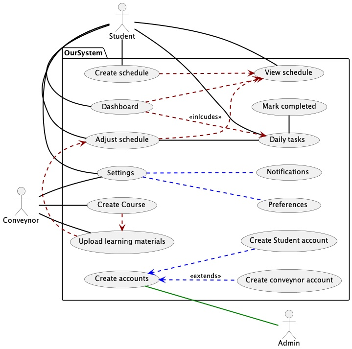

# Use Case Descriptions: :pencil:

## :mag_right: Use case one

### Use case name
Create Schedule
### Purpose
The purpose of this is to allow the primary user (students) to mark things into their calendar for example creating a revision time table of a sorts.
### Author
Jan W Makarewicz
### Date
30/4/2022
### Related requirements
Users are able to select the most optimal study split from a pre-made list.
### Actors involved
The primary actors are the students and the secondary actors are the module convenor.
### Priority
It is very important as the student will likely be keeping track of the schedule created and could be making changes to their schedules.
### Typical flow of events
1. The user selects the create schedule hyperlink.
2. The system wil display a table that includes upcoming dates and timeslots.
3. The student will then be able to input the required subjects that need to be studied.
4. The system then computes and develops a personalised timetable detailing which studies will need to completed and allocates appropriate timeslots.
### Alternative event flows
It extends making an account as you would need an account to make this use case even work.

## :mag_right: Use case two

### Use case name
Student wishes to mark their daily tasks as complete.
### Purpose
The end goal of this use case is to allow students to mark any daily tasks that they have completed easily, to allow them to better manage their time and have a stronger understanding of outstanding work when planning future tasks. It would also be benificial as it would also allow the application to understand which tasks are outstanding when planning a timetable for the student. 
### Author
Jaysinh Maher
### Date
30/04/2022
### Related requirements
This satisfies many of our functional requirement, specifically "The system must adjust the user's study schedule when daily tasks are not complete". This is because in order to alter the study schedule to be more efficient the system must know which tasks are and are not outstanding. Another functional requirement that is satisfied is "Each day the system will notify the user of their daily tasks to complete". This is because once again to help students stay on top of work these notifications are necassary and cannot be accurate unless the user can mark completed tasks.
### Actors involved
The Primary Actors are the students who are responsible for updating the completion of tasks.
### Priority
This use case must be implemented as a substantial goal of our system is to keep users on top of their workload and allow them to ensure that they can plan their timetables accurately and efficiently. Without being able to manage which tasks are and aren't complete the user wouldn't be able to keep track of tasks anywhere near as easily. Providing notifications of incomplete work is also a huge benifit as the user cannot accidentally forget or get confused with deadlines. Constant daily reminders also ensures that the students are always aware of their workload, mitigating the chances of them putting it off, or procrastinating.
### Typical flow of events
1. Student would navigate to the daily tasks subsection.
2. The system would showcase the various tasks/scheduled meetings that were assigned for this day.
3. The student would then select the checkbox.
4. The system would recognise this task as now being completed and delete it.
### Alternative event flows
An Alternative event scenario could be the possibility of no assigned tasks(Holidays/End of term) in which case the subsection would be empty.

## :mag_right: Use case three

### Use case name
Settings
### Purpose
The end goal of this use case is to allow students to adjust the settings which include notifications and user preferences for the use of the system. This allows the system to gain permission to send notification to the user (i.e daily tasks). Preferences include other setting for the user interface (layout, contacts syncing, calnedar syncing permission).
### Author
Youssef Sadquy
### Date
02/05/2022
### Related requirements
NOTIFICATION SETTINGS
-   The student must select how they want to be notified
-   The system can send notifications via email, SMS, push notifications
-   The system should have the ability to allow a user to modify how long prior to the event a notification is sent out, e.g. 5 or 10 minutes

PREFERENCES SETTINGS
-   The student must be able to select how they wish to be notified through email, SMS, smartphone notifications, or a combination of all methods
### Actors involved
The primary actors are the students and the secondary actors are the module convenor
### Priority
It is quite important, primarily because the student will be notified for schedules, tasks via notifications which need to be allowed through the settings, secondarily because the preferences, for the ease of use of the system such as calendar syncing is performed through the settings.
### Typical flow of events
The flow of the use case includes the enabling from the user of the notifications and the changing of their own preferences within the system.
### Alternative event flows
It extends making an account as you would need an account to make this use case work.

## :mag_right: Use case four

### Use case name
Notifications
### Purpose
The end goal of this use case to allow students to view any notifications regarding their schedule. This will inlcude updates regarding their timelines, any new information or workloads being set or even messages from the system itself detailing updates such as bug fixes. 
### Author
Kalam Hakim
### Date
03/05/2022
### Related requirements
(The system will provide for manual adjustment of the study schedule dates and times)- Student will be shown these updates in real time in a dedicated hyperlink/subsection to allow for concise updates. (The system should notify the user about all upcoming events, these being; lectures, tutorials, labs, seminars, exams and study sessions) - Student will be informed about any changes to schedule including lecture or tutorial times along with the initial posting time and pre-reminders set to allow the student enough warning to ensure they arrive on time.
### Actors involved
The primary actors are the students and the secondary actors are the module convenor.
### Priority
High Priority. Students need to. be informed as direct and quickly as possible about upcoming events, deadline changes or new work beig set.
### Typical flow of events
The flow of events is that as soon as an update to the system is made (work added or class upcoming) the user is informed with a notification that they can then view in full detail by clicking on the notificaiton subsection.
